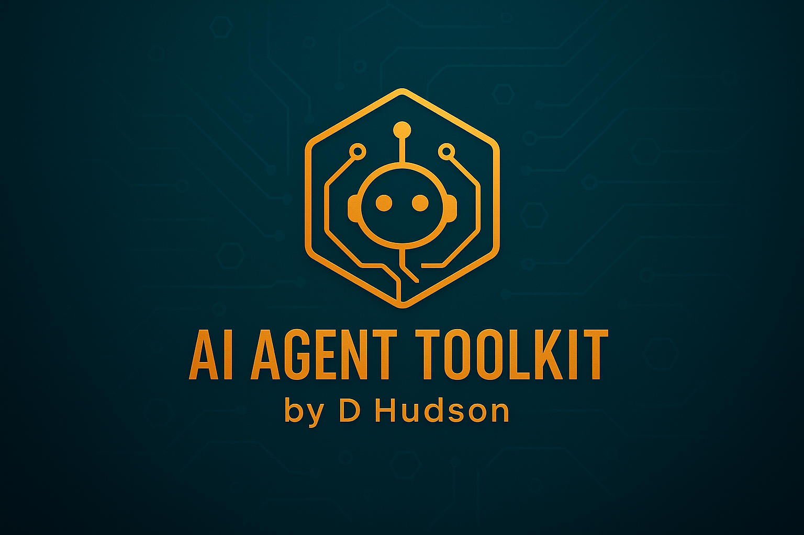

# AI Agent Toolkit by D Hudson



A comprehensive, professional-grade toolkit for building, deploying, and managing AI agents. This Streamlit application provides everything you need to get started with AI agent development, from beginner guides to advanced implementation strategies.

## 🚀 Features

- **Professional UI**: Dark theme with orange/gold accents matching modern AI branding
- **User Authentication**: Secure login system with Supabase integration
- **Role-Based Access**: Admin and user roles with different permissions
- **Resource Downloads**: PDF guides including "Ultimate AI & Bot Checklist" and "250 Best AI Tools"
- **Cloud-Ready**: Optimized for deployment on cloud platforms
- **Responsive Design**: Works seamlessly across desktop and mobile devices

## 📚 Included Resources

### 1. The Ultimate AI & Bot Checklist
A comprehensive checklist covering:
- Planning and Design phase
- Development and Implementation
- Testing and Deployment
- Monitoring and Maintenance

### 2. 250 Best AI Tools Directory
Curated list of AI tools across categories:
- Content Creation & Writing
- Image & Visual AI
- Video & Audio tools
- Business & Productivity
- Data & Analytics

## 🛠️ Technology Stack

- **Frontend**: Streamlit with custom CSS styling
- **Backend**: Python with Supabase integration
- **Database**: Supabase (PostgreSQL)
- **Authentication**: Supabase Auth
- **Deployment**: Cloud-ready configuration

## 📦 Installation

1. **Clone the repository**:
   ```bash
   git clone <repository-url>
   cd ai-agent-toolkit
   ```

2. **Install dependencies**:
   ```bash
   pip install -r requirements.txt
   ```

3. **Configure Supabase**:
   - Create a Supabase project
   - Update `.streamlit/secrets.toml` with your credentials:
   ```toml
   [supabase]
   url = "your-supabase-url"
   key = "your-supabase-anon-key"
   ```

4. **Run the application**:
   ```bash
   streamlit run main_app.py
   ```

## 🔧 Configuration

### Supabase Setup
Create the following table in your Supabase database:

```sql
CREATE TABLE user_profiles (
    id UUID REFERENCES auth.users(id) PRIMARY KEY,
    email TEXT NOT NULL,
    role TEXT NOT NULL DEFAULT 'user',
    created_at TIMESTAMP WITH TIME ZONE DEFAULT NOW()
);
```

### Environment Variables
The application uses Streamlit secrets for configuration. Create `.streamlit/secrets.toml`:

```toml
[supabase]
url = "https://your-project.supabase.co"
key = "your-anon-key"
service_role_key = "your-service-role-key"
```

## 🎨 Customization

### Branding
- Logo files: `logo.png`, `logo-square.png`, `banner.png`
- Colors: Orange/gold (#f59e0b) and dark blue/teal theme
- Typography: Inter font family

### Styling
The application uses custom CSS defined in `main_app.py`. Key style elements:
- Dark gradient background
- Orange/gold accent colors
- Professional card layouts
- Smooth animations and transitions

## 📱 Pages Structure

- **Main Dashboard**: User/Admin dashboards with role-based features
- **AI Agents**: Guide to understanding and building AI agents
- **AI Tools**: Directory of curated AI tools
- **Resources**: Download center for PDF guides

## 🔐 Security Features

- Secure authentication with Supabase
- Role-based access control
- Password reset functionality
- Session management
- Cloud deployment optimizations

## 🚀 Deployment

### Streamlit Cloud
1. Push to GitHub repository
2. Connect to Streamlit Cloud
3. Add secrets in Streamlit Cloud dashboard
4. Deploy automatically

### Docker Deployment
```dockerfile
FROM python:3.9-slim

WORKDIR /app
COPY requirements.txt .
RUN pip install -r requirements.txt

COPY . .

EXPOSE 8501

CMD ["streamlit", "run", "main_app.py", "--server.port=8501", "--server.address=0.0.0.0"]
```

## 📖 Usage

### For Users
1. Sign up for an account
2. Access AI resources and guides
3. Download PDF materials
4. Explore AI tools directory

### For Admins
1. Monitor user analytics
2. Manage user accounts
3. Access system reports
4. Configure application settings

## 🤝 Contributing

We welcome contributions! Please:
1. Fork the repository
2. Create a feature branch
3. Make your changes
4. Submit a pull request

## 📄 License

This project is licensed under the MIT License - see the LICENSE file for details.

## 🔗 Links

- **Main Resource Hub**: [Entremotivator.com](https://entremotivator.com)
- **Documentation**: See individual page files for detailed guides
- **Support**: Contact through the application's support form

## 👨‍💻 Author

**D Hudson** - AI Agent Toolkit Creator

---

*Built with ❤️ for the AI community. Empowering developers to create intelligent, autonomous systems.*
